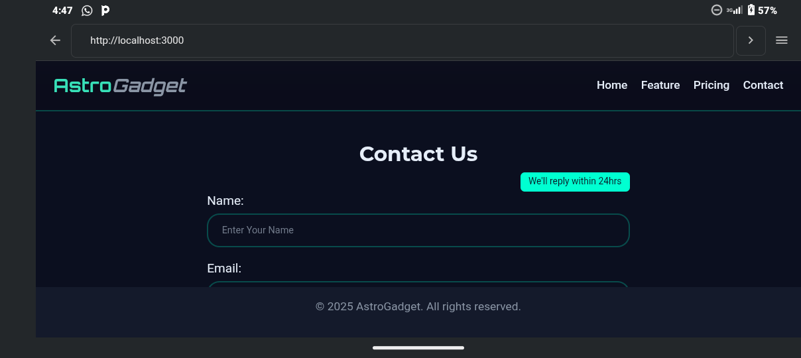
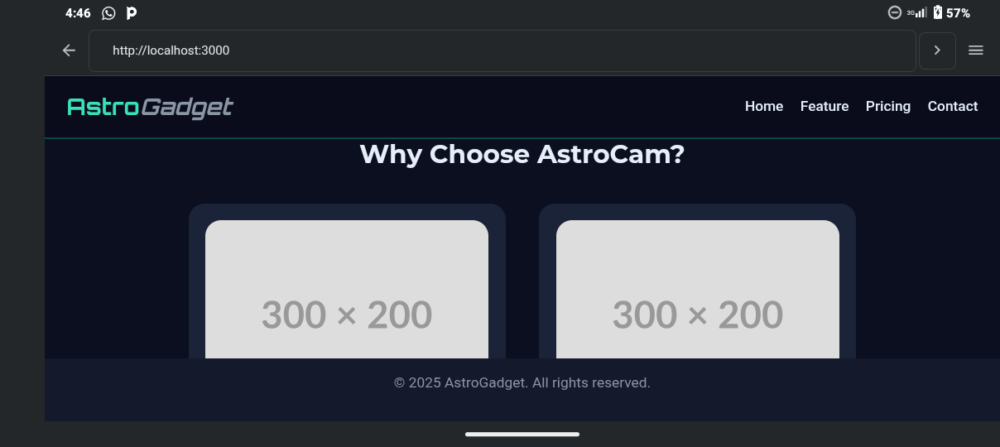

<h1 align="center">🚀 AstroGadget — The Future of Vision 🚀</h1>

<p align="center">
  A sleek landing page showcasing <b>AstroCam</b> — the next-generation smart camera drone, built with pure HTML and CSS.
</p>

<p align="center">
  
  
  
  
  
</p>

---

## 🌌 Live Preview

👉 **View Site:** [AstroGadget Landing Page](https://benedictsamuel163-blip.github.io/AstroGadget/)

---

## 🖼️ Project Preview

<p align="center">
  
  
</p>

---

## 🧩 Features

- 🎯 **Clean, futuristic layout** with vibrant accent colors  
- 🧱 **CSS Positioning mastery** — relative, absolute, sticky & fixed elements  
- 💨 Smooth transitions and animations with accessibility via `prefers-reduced-motion`  
- 📱 **Fully responsive** — adapts seamlessly from desktop to mobile  
- ♿ **Accessible** design using `aria-label` and semantic HTML  
- ⚙️ Built and deployed directly from **Termux**

---

## 🛠️ Technologies Used

- **HTML5**
- **CSS3 (Flexbox, Positioning, Transitions)**
- **Git + Termux**
- **GitHub Pages**

---

## 🧑‍💻 Author

**Ben (Scholar Junior)**  
💬 _“I build futuristic projects that make design and learning meet.”_

- GitHub: [@benedictsamuel163-blip](https://github.com/benedictsamuel163-blip)  
- Email: benedictsamuel163@gmail.com  

---

## ⭐ How to Use

```bash
# Clone this repository
git clone https://github.com/benedictsamuel163-blip/AstroGadget.git

# Navigate into the folder
cd AstroGadget

# Open in browser
open index.html